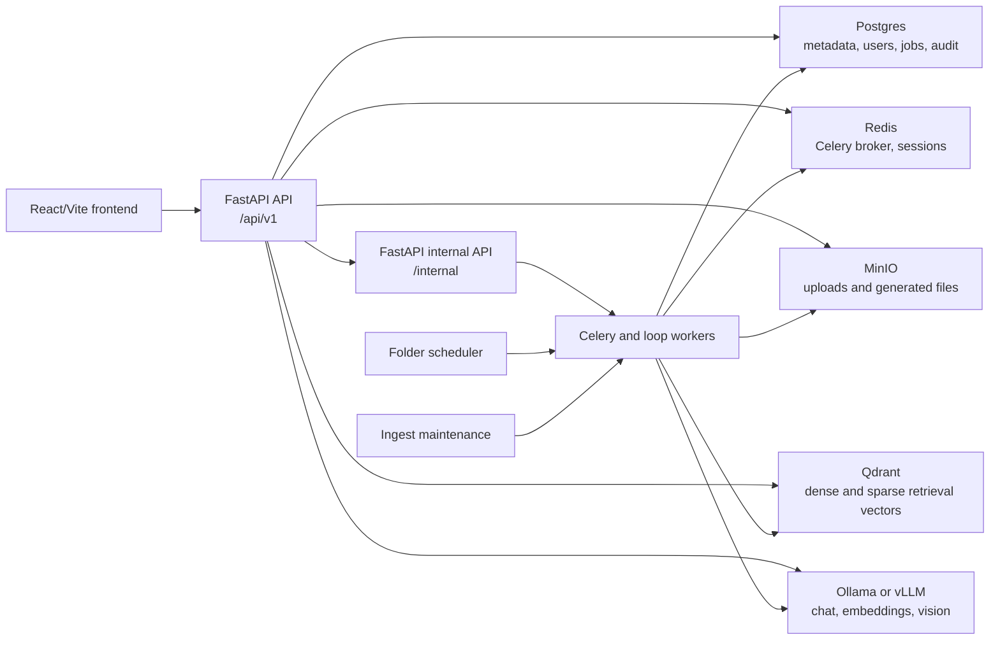
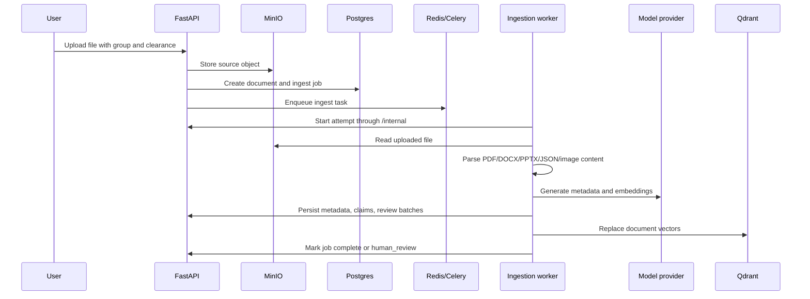
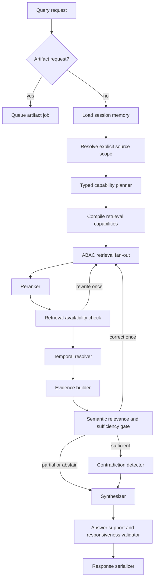

# Prudentia AI / AgenticRAG Design

Last updated: 2026-06-18

## Purpose

Prudentia AI, also called AgenticRAG in the codebase, is a local enterprise RAG
workspace for controlled document intake, retrieval-augmented question
answering, evidence inspection, OCR review, auditability, answer evaluation,
and grounded artifact generation.

The system is designed for deployments where data locality, role-aware access,
clearance boundaries, and offline model execution matter. Runtime containers
default to offline model loading and should fail fast when required model
artifacts are missing.

## Design Goals

- Keep document access enforceable before evidence leaves storage.
- Preserve source provenance so answers can be inspected and challenged.
- Support local and airgapped operation with Ollama or OpenAI-compatible vLLM
  backends.
- Make ingestion and generation durable through queued jobs, retries,
  cancellation, progress updates, and audit events.
- Separate public browser APIs from internal service APIs.
- Keep the frontend role-aware so users only see workflows their account can
  operate.

## High-Level Architecture



## Runtime Components

| Component | Main files | Responsibility |
| --- | --- | --- |
| Frontend | `frontend/src/App.tsx`, `frontend/src/routes.ts`, `frontend/src/api/*` | Browser application, role-gated navigation, chat, uploads, document library, review queue, audit, settings, evaluations, SSE query streaming. |
| Public API | `backend/apps/api/main.py`, `backend/src/rag/api/routes/*` | Authenticated REST and streaming API under `/api/v1`. Handles auth, upload, documents, query, review, audit, admin, evaluations, and artifact job endpoints. |
| Internal API | `backend/src/rag/internal/*` | Service-token protected endpoints under `/internal` used by workers for job state, config snapshots, review batches, ABAC context, claims, and supersession. |
| Ingestion and GraphRAG workers | `backend/apps/workers/document_pipeline/*`, `backend/src/rag/ingestion/*`, `backend/src/rag/graphrag/*` | Shared Celery runtime whose separately deployed services consume the ingestion and GraphRAG queues. |
| Artifact worker | `backend/apps/workers/artifact/*`, `backend/src/rag/artifact_jobs/*` | Durable document generation workflow. Plans, retrieves evidence, composes content, validates grounding, renders files, stores outputs, and reports progress. |
| Evaluation worker | `backend/apps/workers/evaluation/*`, `backend/src/rag/evaluations/*` | Runs imported evaluation datasets against the current RAG configuration and stores per-case diagnostics. |
| Background services | `backend/apps/background/*` | Runs artifact cleanup, scheduled folder dispatch, and ingestion recovery/capacity maintenance on independent loops. |
| Deployment controller | `backend/apps/deployment_controller/*`, `backend/src/rag/deployment/*` | Authenticated internal control-plane service that serializes and applies allowlisted vLLM Compose launch-limit changes. |
| Model services | `docker-compose.yml` | Optional vLLM text, embedding, and vision services, plus host Ollama support through `host.docker.internal`. |

## Persistent State

| Store | Contents |
| --- | --- |
| Postgres | Users, groups, document metadata, ingestion jobs, folder schedules, audit log, claims, conflicts, OCR review batches, chat history, artifact jobs, generated artifact metadata, evaluation datasets, and evaluation runs. |
| Qdrant | Retrieval points for document chunks, including dense vectors, sparse vectors, ABAC payload fields, source anchors, metadata, claim markers, and current/superseded state. |
| MinIO | Uploaded source files, document image assets, folder snapshot files, and generated artifact binaries. |
| Redis | Celery broker state, refresh sessions, and query session cache when configured. |
| Local model cache | FastEmbed sparse/reranker models, Docling/RapidOCR artifacts, and optional Hugging Face model cache for vLLM. |

The API bootstraps and repairs the Postgres schema on startup through
`backend/src/rag/bootstrap/schema.py`. Repository implementations generally
provide both Postgres and memory variants so tests can isolate behavior without
standing up the full stack.

## Public API Shape

The public API is mounted under `/api/v1`.

- `/auth`: login, refresh, logout, current user, password changes.
- `/upload`: browser file upload and upload status.
- `/folder-ingest`: folder snapshot and MinIO prefix schedules.
- `/ingest-jobs`: ingestion job list, summaries, recovery, cancellation.
- `/docs`: document inventory, source files, page assets, metadata updates,
  lifecycle actions, trash, restore, reingest, and permanent delete.
- `/query`: chat sessions, normal and streaming RAG queries, generated artifact
  downloads.
- `/review-queue`: human OCR review actions.
- `/audit-log`: audit event search and filtering.
- `/rag-evaluations`: evaluation datasets and durable evaluation runs.
- `/artifact-jobs`: durable artifact job details, clarification, cancel, retry.
- `/admin`: user, group, RAG runtime, ingest runtime, and vLLM deployment
  configuration.

The internal API is mounted under `/internal` and is for service-to-service
traffic only. It relies on `X-Service-Token` and must not be exposed as a
browser-facing surface.

## Frontend Design

The frontend is a Vite React application using client-side routing rather than
a router package. `frontend/src/routes.ts` defines route ids, paths, aliases,
navigation groups, and role checks. `frontend/src/App.tsx` owns the active route
state and renders the page component for the current route.

Important frontend patterns:

- `ApiClient` sends cookie-authenticated requests with `credentials: "include"`.
- Unsafe methods attach an `X-CSRF-Token` header from the CSRF cookie.
- A single refresh attempt is performed on eligible `401` responses.
- Streaming query responses are parsed as server-sent events.
- Role checks hide unavailable navigation and redirect users to their default
  allowed route.
- Shared hooks manage auth, chat sessions, document inventory, uploads, folder
  ingestion, and UI preferences.

## Authorization Model

The access model combines account type, Knowledge Space membership, document
clearance, and permission version.

Account types are:

- `platform_admin`
- `system_admin`
- `space_admin`
- `contributor`
- `auditor`
- `member`

`contributor`, `member`, and `auditor` surface in the UI as **Document
Contributor**, **Chat Member**, and **Audit Viewer**. `user_manager` and
`reviewer` are legacy internal account types kept for old records and
compatibility; new assignments use `space_admin` for scoped user management and
`contributor` for upload plus review.

Knowledge Spaces are exact group paths such as `/finance` or `/legal`. Current
authorization helpers use exact scope membership rather than descendant
matching for write and manage decisions. Global administrators receive maximum
effective clearance.

Document retrieval is protected with a Qdrant ABAC filter before chunks leave
vector storage:

- User group path must match an allowed document `group_path`.
- Document clearance rank must be less than or equal to the user's effective
  clearance rank.
- Retrieval normally filters to `is_current = true`.

Browser requests use signed access and refresh cookies plus CSRF protection for
unsafe operations. Durable jobs store the submitting user's `permission_version`
so generated artifacts and saved chat history can be invalidated when
permissions change.

## Document Ingestion Flow



The ingestion graph is assembled in
`backend/src/rag/ingestion/pipeline/graph.py`:

1. Mark processing.
2. Download the source file.
3. Extract text and layout using native parsing, layered Docling, OCR, and
   optional vision analysis.
4. Pause for human OCR review when low-confidence OCR blocks exceed the
   configured threshold.
5. Generate and persist metadata.
6. Chunk parsed items and build claim records.
7. Persist claims and conflicts.
8. Generate dense and sparse embeddings.
9. Replace the document's Qdrant points.
10. Commit supersession for replacement uploads.
11. Mark the job complete.

Workers send heartbeats, update stage progress, retry transient provider
failures with backoff, and clean up partial vectors when jobs are cancelled.

## Query Flow



`LocalRagService` builds an effective RAG configuration from environment and
workspace settings, then runs `QueryGraphRunner`. The query graph handles
session memory, typed capability planning, compiled multi-path retrieval,
reranking, bounded correction, temporal resolution, semantic evidence
sufficiency, conflict detection, evidence construction, answer synthesis,
support and responsiveness validation, and response serialization.

Streaming queries use SSE events from `/api/v1/query/stream`. Disconnects
trigger a cancellation token so long-running graph work can stop where
supported.

## Artifact Generation

Artifact requests are detected from query text. The query API returns
immediately with a queued job summary. The artifact worker then:

1. Validates the job context through the internal API.
2. Starts a durable attempt and sends heartbeats.
3. Plans the document and asks for clarification when needed.
4. Retrieves permitted evidence.
5. Composes content and validates grounding.
6. Renders outputs directly in the artifact worker with the deterministic renderer.
7. Stores files in MinIO and metadata in Postgres.
8. Marks the job `complete`, `partial`, `failed`, or `cancelled`.

The public API exposes job status, clarification answers, cancellation, retry,
and download URLs. Downloads are scoped to the creating user and permission
version.

## Human Review

Low-confidence OCR can pause ingestion in `human_review` state. Review batches
store parsed items and the original resume payload. Document Contributors,
Space Admins, System Admins, and Platform Admins approve or reject items through
`/api/v1/review-queue`; approved parsed items are then used by a resume
ingestion task instead of reparsing the original file.

## Folder Ingestion

Folder sources support browser snapshots and MinIO prefix schedules. Schedule
state is stored in Postgres. The folder scheduler runs in a loop, takes a
Postgres advisory lock in Postgres-backed deployments, and dispatches due
schedules to the ingestion queue. Folder ingestion uses the same document,
storage, and indexing pipeline as manual upload.

## RAG Evaluation

Evaluation datasets are imported from JSON or JSONL into normalized cases.
Launching a run snapshots the active RAG configuration, selected document
scope, and submitting user's permission context. The evaluation worker executes
cases, stores answers, sources, diagnostics, node timings, faithfulness status,
and failure breakdowns. Runs support cancellation and retry.

## Airgap Runtime

Runtime defaults favor offline execution:

- `AIRGAP_RUNTIME_OFFLINE=1`
- `HF_HUB_OFFLINE=1`
- `TRANSFORMERS_OFFLINE=1`
- `HF_DATASETS_OFFLINE=1`
- `HF_HUB_DISABLE_TELEMETRY=1`
- `DO_NOT_TRACK=1`

Required artifacts should be prewarmed before disconnecting:

- vLLM model cache under `/models/huggingface`
- FastEmbed sparse and reranker cache under `/models/fastembed`
- Docling and RapidOCR artifacts under `/models/docling`

The normal Compose stack does not start vLLM unless the `vllm` profile is
enabled. Deployments can stay on Ollama while vLLM services are absent.

## Reliability and Operations

- Health endpoints exist for API, frontend, storage services, and model services.
- Ingestion, artifact, and evaluation jobs keep explicit statuses, progress
  percentages, stage details, attempt counts, retry limits, errors, completion
  timestamps, and heartbeats.
- Ingest maintenance detects stale jobs and helps recover interrupted work.
- Background queues use Redis/Celery by default.
- Audit events record security-relevant and document-lifecycle actions.
- Generated artifacts and evaluation runs have retention windows.
- Service-to-service calls use the configured internal backend URL and service
  token.

## Testing Strategy

Backend tests live under `backend/tests` and focus on permissions, ingestion,
query routing, retrieval, source handling, faithfulness, artifact routing, and
evaluation diagnostics. Frontend tests live next to TypeScript source files and
cover API contracts, routes, upload state, evidence rendering, audit utilities,
source viewing, and page-level behavior.

Preferred local checks:

```sh
cd backend
pytest
```

```sh
cd frontend
npm run typecheck
npm test
npm run build
```

## Extension Guidelines

- Add new browser-facing behavior through `/api/v1` routes and shared frontend
  API contracts.
- Add worker-only state changes through `/internal` routes protected by the
  service token.
- Keep ABAC payload fields in Qdrant synchronized with document metadata when
  document scope, clearance, or lifecycle state changes.
- Store durable workflow state in Postgres before enqueueing Celery work.
- Preserve provenance fields whenever parsing, chunking, or rendering logic
  changes.
- Keep offline runtime behavior explicit. Runtime code should not silently
  download models in airgapped deployments.
